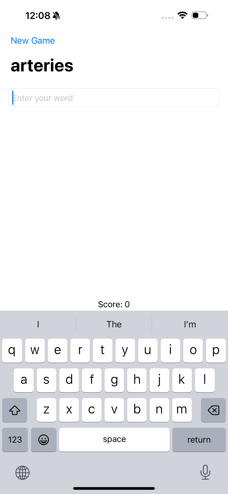

# Topic covers in project 5 :-

- List
- onAppear method 
- loading files from app Bundle
- used of fatalError()
- UITextChecker

## Screenshots
<table align="center">
  <tr>
    <td></td>
    <td style="width: 50px;"></td>
    <td></td>
  </tr>
   <tr>
    <td></td>
    <td style="width: 50px;"></td>
    <td></td>
  </tr>
</table>
