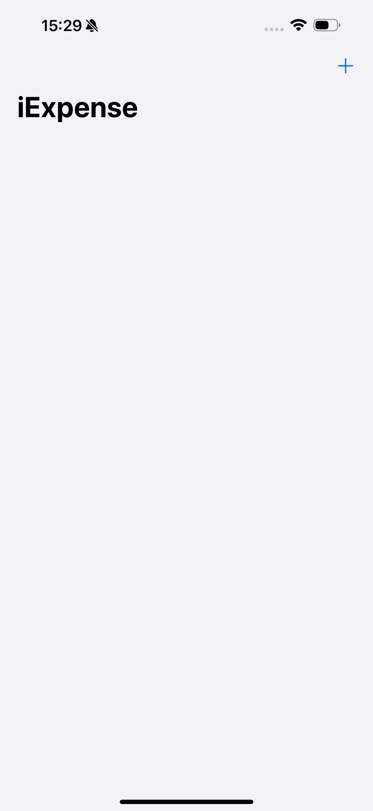
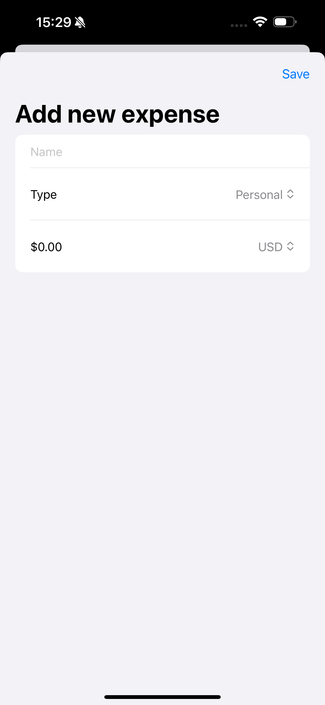
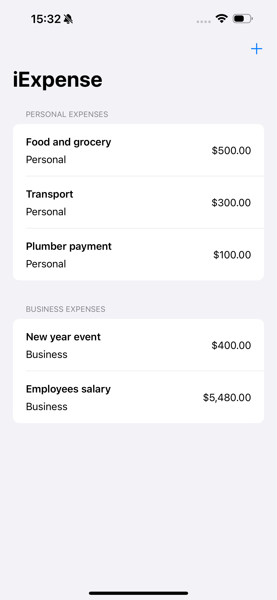
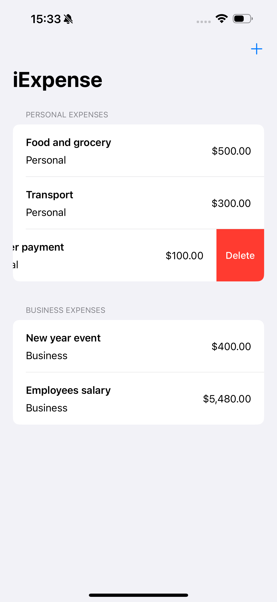
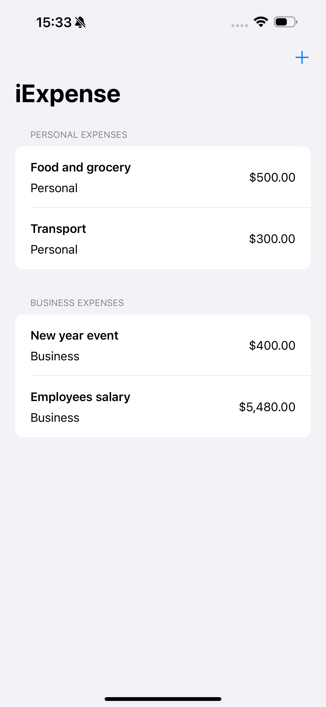

# Topic covers in project 7 :-

, , , , 
- UserDefaults
- Codable
- sheet()
- onDelete()
- @Observable
- deletion on multi-section list

## Screenshots
<table align="center">
  <tr>
    <td></td>
    <td style="width: 50px;"></td>
    <td></td>
  </tr>
   <tr>
    <td></td>
    <td style="width: 50px;"></td>
    <td></td>
  </tr>
   <tr>
    <td></td>
    <td style="width: 50px;"></td>
    <td></td>
  </tr>
</table>
