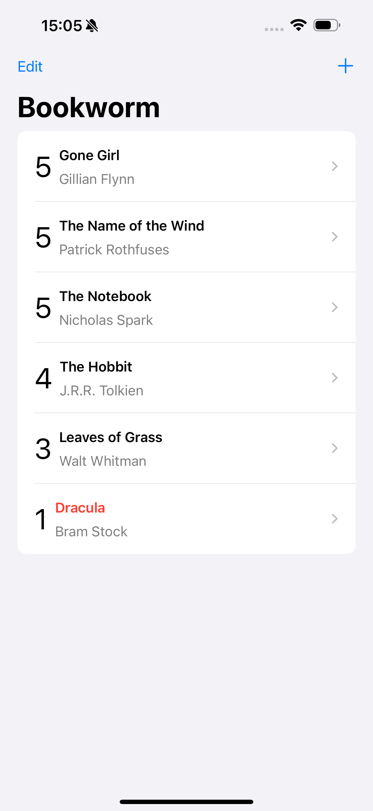
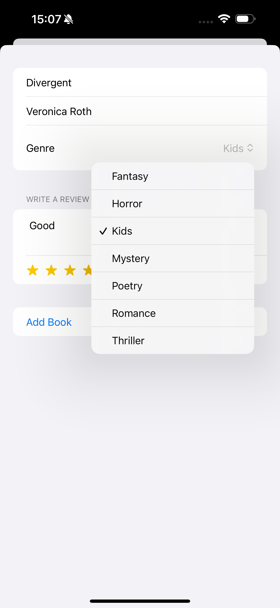
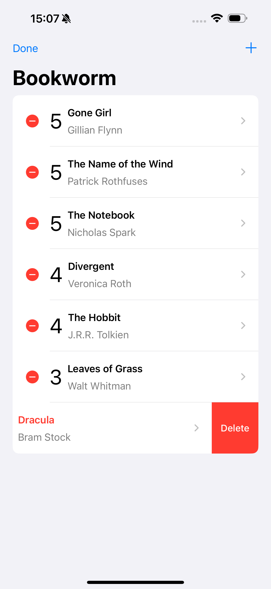

# Topic covers in project 11 :-

- @Binding
- TextEditor
- SwiftData
- Fecthing from SwiftData
- Sorting
- Delete in SwiftData
- Alert
- Sheet
- list 

## Screenshots
<table align="center">
  <tr>
    <td></td>
    <td style="width: 50px;"></td>
    <td></td>
  </tr>
   <tr>
    <td></td>
    <td style="width: 50px;"></td>
    <td></td>
  </tr>
  <tr>
    <td></td>
    <td style="width: 50px;"></td>
    <td></td>
  </tr>
  
</table>
