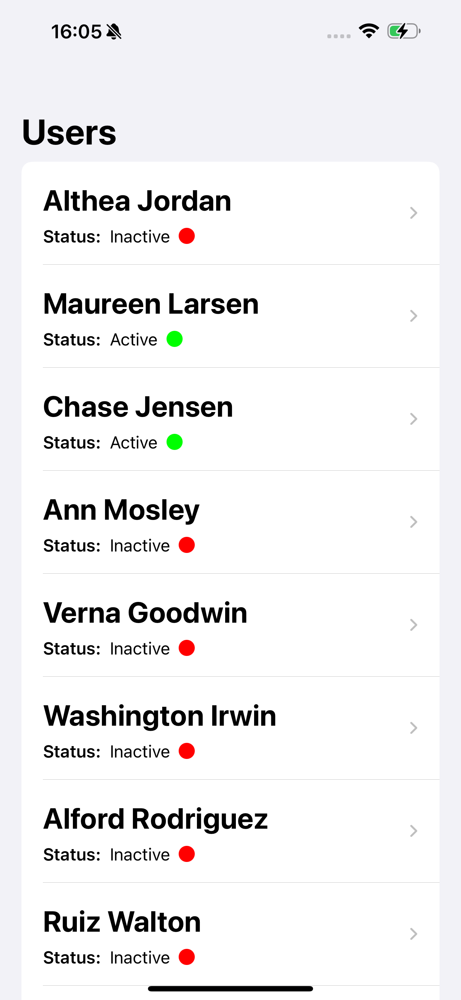
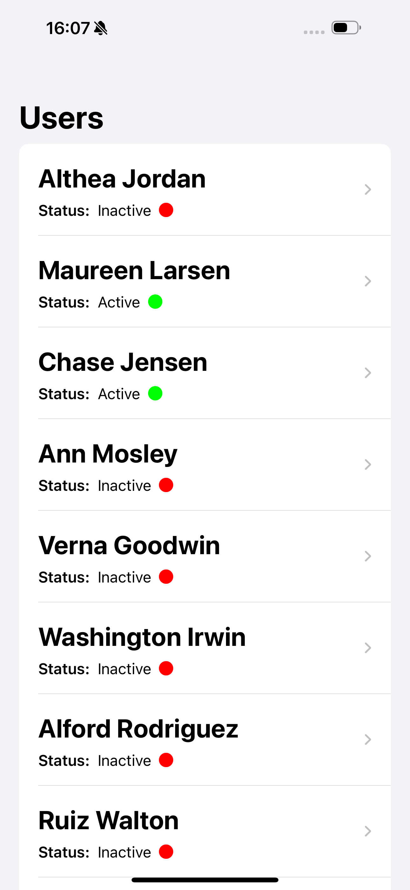
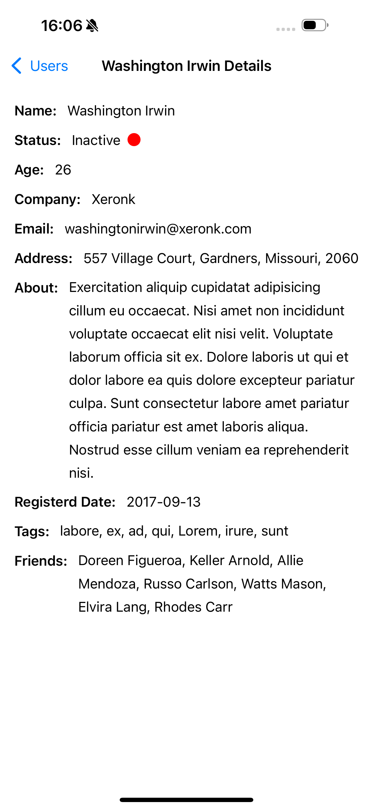

# Topic covers in Milestone of project 10-12 :-

- URL session
- Codable 
- SwiftData
- Fecthing from SwiftData
- Sorting

This milestone is based on api calling getting data from internet and then save it locally for upcoming use.

## Screenshots
<table align="center">
  <tr>
    <td></td>
    <td style="width: 50px;"></td>
  </tr>
   <tr>
    <td></td>
    <td style="width: 50px;"></td>
    <td></td>
  </tr>
  
</table>
