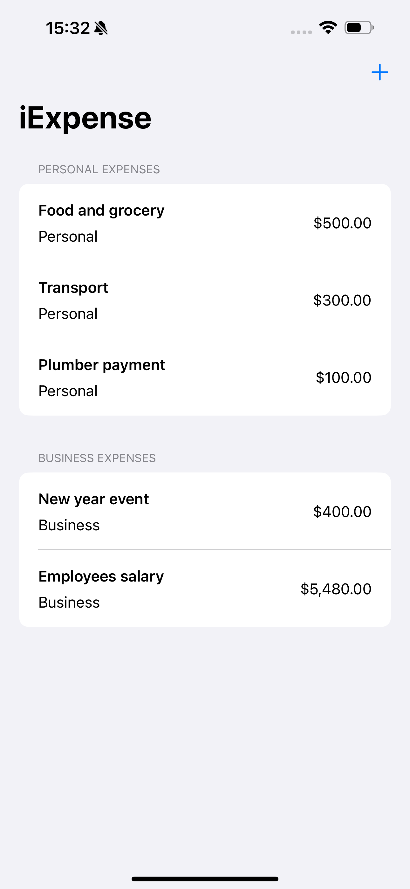
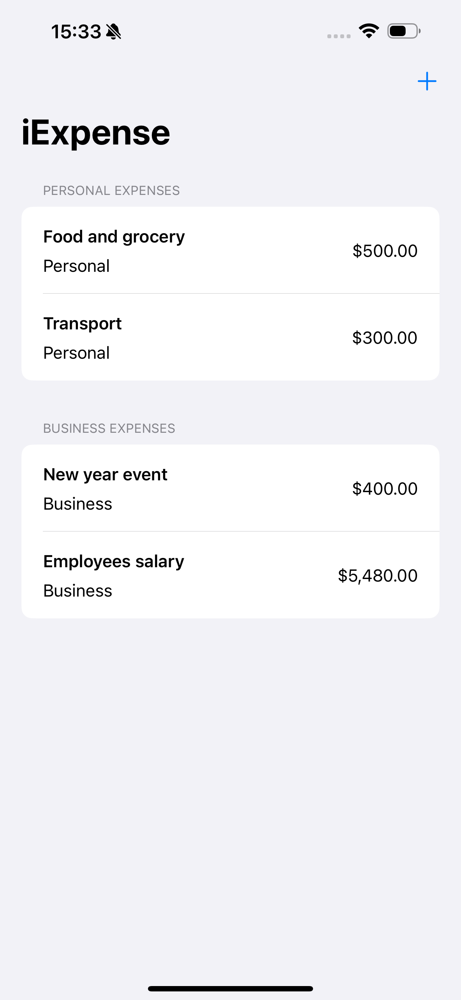
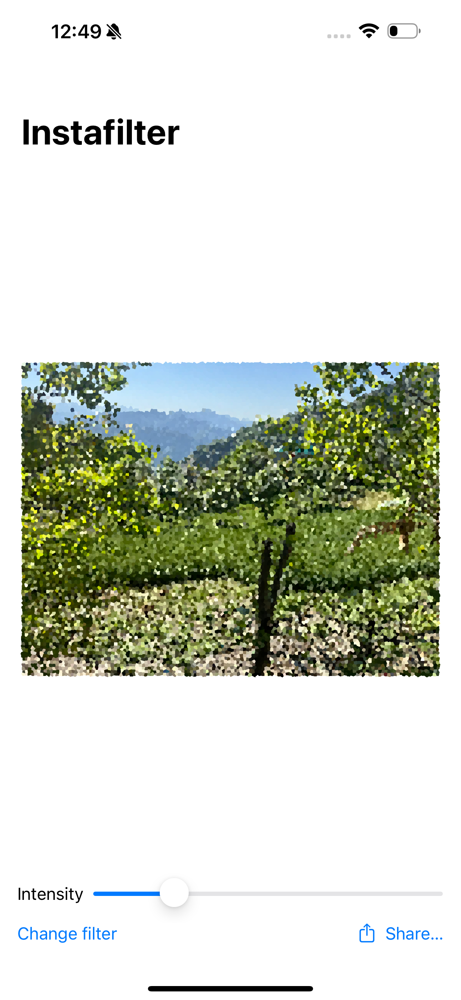

# 100-Day-of-SwiftUI
I worked through the projects and challenges from Paul Hudson's "100 Days of SwiftUI" course, available at [Hacking with Swift](https://www.hackingwithswift.com/100/swiftui). During this journey, I developed a SwiftUI project and gained in-depth experience with SwiftUI, exploring many of its most frequently used controls.

## **Project 1 Screenshots**
<table align="center">
  <tr>
    <td></td>
    <td style="width: 50px;"></td>
    <td></td>
  </tr>
</table>

## **Project 2 Screenshots**
<table align="center">
  <tr>
    <td></td>
    <td style="width: 50px;"></td>
    <td></td>
  </tr>
</table>

## **Project 4 Screenshots**
<table align="center">
  <tr>
    <td></td>
    <td style="width: 50px;"></td>
    <td></td>
  </tr>
</table>

## **Project 5 Screenshots**
<table align="center">
  <tr>
    <td></td>
    <td style="width: 50px;"></td>
    <td></td>
  </tr>
   <tr>
    <td></td>
    <td style="width: 50px;"></td>
    <td></td>
  </tr>
</table>

## **Project 7 Screenshots**
<table align="center">
  <tr>
    <td></td>
    <td style="width: 50px;"></td>
    <td></td>
  </tr>
   <tr>
    <td></td>
    <td style="width: 50px;"></td>
    <td></td>
  </tr>
   <tr>
    <td></td>
    <td style="width: 50px;"></td>
    <td></td>
  </tr>
</table>

## **Project 8 Screenshots**
<table align="center">
  <tr>
    <td></td>
    <td style="width: 50px;"></td>
    <td></td>
  </tr>
   <tr>
    <td></td>
    <td style="width: 50px;"></td>
    <td><video src='08-Project8/ScreenShots/ScreenRecording_12-30-2024 17-23-09_1.MP4' width=300/></td>
  </tr>
</table>

## **Project 10 Screenshots**
<table align="center">
  <tr>
    <td></td>
    <td style="width: 50px;"></td>
    <td></td>
  </tr>
   <tr>
    <td></td>
    <td style="width: 50px;"></td>
    <td></td>
  </tr>
  <tr>
    <td></td>
    <td style="width: 50px;"></td>
    <td></td>
  </tr>
</table>

## **Project 11 Screenshots**
<table align="center">
  <tr>
    <td></td>
    <td style="width: 50px;"></td>
    <td></td>
  </tr>
   <tr>
    <td></td>
    <td style="width: 50px;"></td>
    <td></td>
  </tr>
  <tr>
    <td></td>
    <td style="width: 50px;"></td>
    <td></td>
  </tr>
</table>

## **Project 12 Screenshots**
<table align="center">
  <tr>
    <td></td>
    <td style="width: 50px;"></td>
    <td></td>
  </tr>
   <tr>
    <td></td>
    <td style="width: 50px;"></td>
    <td></td>
  </tr>
  <tr>
    <td></td>
    <td style="width: 50px;"></td>
    <td></td>
  </tr>
</table>

## **Project 13 Screenshots**
<table align="center">
  <tr>
    <td></td>
    <td style="width: 50px;"></td>
    <td></td>
  </tr>
   <tr>
    <td></td>
    <td style="width: 50px;"></td>
    <td></td>
  </tr>
    <tr>
    <td></td>
    <td style="width: 50px;"></td>
    <td></td>
  </tr>
</table>

## **Project 14 Screenshots**
<table align="center">
  <tr>
    <td></td>
  </tr>
   <tr>
    <td></td>
    <td style="width: 50px;"></td>
    <td></td>
  </tr>
    <tr>
    <td></td>
    <td style="width: 50px;"></td>
    <td></td>
  </tr>
</table>

